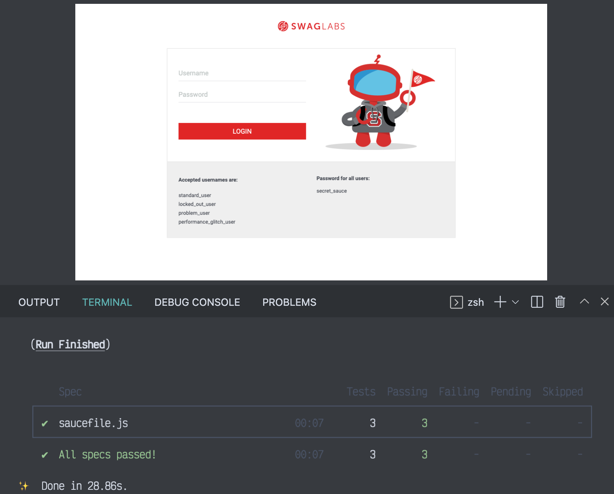

#  :test_tube: Visual Regression Tests 
[](https://)

## From a website demo, testing visual regression tests with Cypress




## Language/tools 🛠
- Javascript
- Cypress
- Plugin : cypress-image-snapshot
  

## Goals 🏔
- Discover visual regression tests
- Deep practice of Cypress

## How to use 🛠

### Visit the website demo on https://www.saucedemo.com/

### Launch the Cypress tests
```javascript
yarn cypress run 
or 
npx cypress run 
```

## Status 🎯
Project completed

## Context 📆
Project developed as a junior web developer. I realized the implementation of these tests during my internship in BTS SIO SLAM. The subject of this internship, in the start up Iole Solutions, was about the integration of E2E tests in an application under development. This is one of the reasons that pushed me to get interested in Cypress
